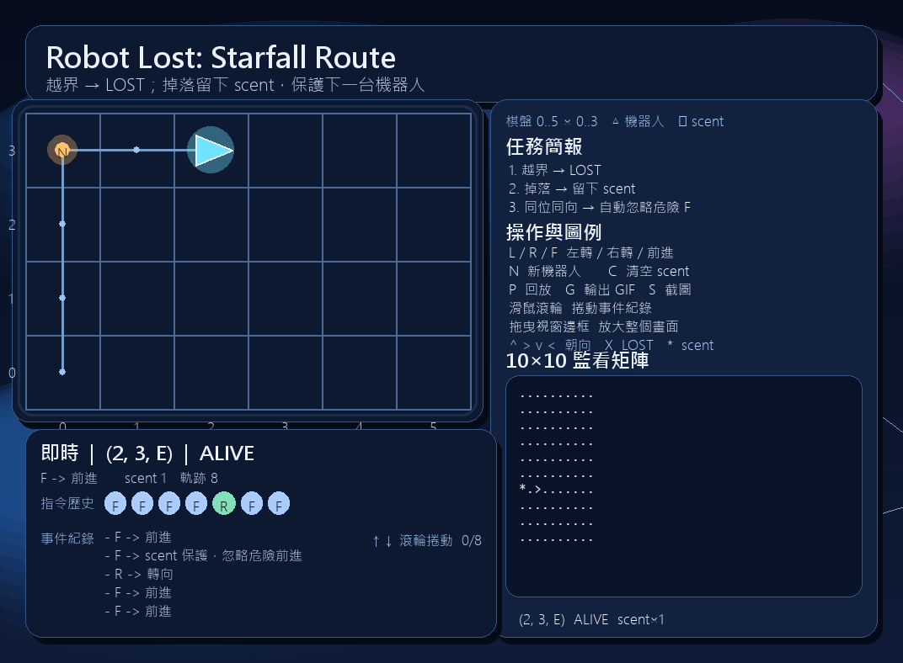

# Week 03 - 1114405011

## 遊戲定位

這版不再只是「把題目做成能動的作業畫面」，而是把 UVA 118 的規則包成一個有任務感的小型星圖巡航介面。

- 主題風格改成深色星空背景與控制台式資訊面板
- 左側主畫面負責操作與觀察軌跡
- 右側用任務簡報、操作說明、圖例與 10x10 監看矩陣幫玩家快速理解規則
- 下方顯示目前狀態、指令歷史與事件紀錄，不用自己猜剛剛發生什麼事

## 這版比較好玩的地方

- 畫面不再像單純作業截圖，而是有明確主題氛圍
- 玩家一進去就能看懂目標：邊界外會 LOST，scent 會保護下一台機器人
- 有路徑回放、GIF 匯出、矩陣快照，觀察規則變化比較直覺
- 說明集中在同一個畫面，不用邊玩邊回 README 找按鍵

## 功能清單

- 支援格子地圖顯示（座標範圍 0..5, 0..3）
- 支援機器人朝向顯示（三角形 + 發光效果）
- 支援 scent 顯示（橘色點 + 方向字母）
- 支援軌跡線顯示，能直接看出移動歷程
- 鍵盤單步輸入 `L` / `R` / `F`
- `N` 建立新機器人（保留 scent）
- `C` 清除全部 scent
- `P` 回放目前機器人的路徑（replay 模式）
- `G` 匯出 `assets/replay.gif`
- `S` 儲存實際遊玩截圖到 `assets/gameplay.png`
- `M` 匯出 `assets/matrix_snapshot.txt`（10x10 字串矩陣 + scent 容器）
- LOST 後停止該機器人的後續指令
- 介面文字、狀態訊息、操作提示皆為中文一致呈現

## 執行方式

- Python 3.14+
- 安裝套件：

```bash
pip install pygame-ce pillow
```

- 說明：本環境為 Python 3.14，使用 `pygame-ce` 提供 `import pygame` 相容介面。

- 啟動遊戲（在本資料夾）：

```bash
python robot_game.py
```

## 畫面說明

- 左側：主棋盤，直接操作 `L / R / F` 看機器人怎麼移動
- 右側：任務簡報、按鍵說明、符號圖例、10x10 監看矩陣
- 下方：目前狀態、最近指令、事件紀錄

如果只是第一次打開想快速理解，實際上只要看右側面板就夠了，不用先讀完整份題目。

## 建議遊玩流程

1. 先用 `F` 試著把機器人推向邊界，看它何時會 LOST。
2. 再按 `N` 建立第二台機器人，觀察同位置同方向是否因 scent 被保護。
3. 用 `P` 回放剛才的路徑，確認規則理解是否正確。
4. 用 `G` 或 `S` 產生交付用素材。

## 測試方式

執行指令：

```bash
python -m unittest discover -s tests -p "test_*.py" -v
```

摘要：

- 總測試數：15
- 通過：15
- 失敗：0

最終測試命令：

```bash
python -m unittest discover -s tests -p "test_*.py" -v
```

## 資料結構選擇理由

1. `set[tuple[int, int, str]]` 用來存 scent，查詢危險點可在常數時間完成。
2. `RobotState` 使用 `dataclass`，讓狀態欄位固定且可讀性高。
3. 將 `robot_core.py` 與 `robot_game.py` 分離，讓規則可單測、畫面可獨立調整。
4. `current_track` 保留目前機器人的軌跡，讓回放、GIF 與路徑視覺化可以共用同一份資料。

## 一個踩到的 bug 與修正

- 問題：一開始把 scent 寫成只記錄 `(x, y)`，導致同格不同方向也被錯誤擋下。
- 修正：改為 `(x, y, dir)` 作為 key，並新增測試 `test_same_cell_different_direction_does_not_share_scent`。

## 遊玩截圖



## 操作摘要

- `L / R / F`：左轉 / 右轉 / 前進
- `N`：部署新機器人，保留既有 scent
- `C`：清除所有 scent
- `P`：切換回放模式
- `G`：匯出 replay GIF
- `S`：儲存完整截圖
- `M`：匯出矩陣快照
- 滑鼠左鍵 / 右鍵：放大 / 縮小

## 重播方式

- 進入遊戲後先用 `L` / `R` / `F` 操作幾步。
- 按 `P` 會切換為回放模式，依序播放當前機器人的歷程。
- 再按一次 `P` 會回到即時模式。
- 按 `G` 可把目前路徑匯出成 `assets/replay.gif`。

## 10x10 矩陣與容器觀察（加分項）

- 右側面板固定顯示 10x10 字串矩陣。
- 矩陣符號：`*` 表示 scent，`^ > v <` 表示機器人方向，`X` 表示 LOST。
- 按 `M` 可輸出 `assets/matrix_snapshot.txt`，內容包含：
	- 當前 10x10 矩陣
	- 機器人狀態
	- scent 容器內容（tuple 清單）

## 規格對照摘要

1. `L/R/F`、越界 `LOST`、`scent` 阻擋：由 `robot_core.py` 實作並以 `unittest` 驗證。
2. `scent` 使用 `(x, y, dir)`，避免同格不同方向誤攔截。
3. `LOST` 後停止執行該機器人後續指令。

## 設計調整重點

- 原本的介面偏向「功能有做到」，但吸引力不足。
- 這次優化重點不是改規則，而是改表現方式：
	- 背景加入星空與控制台感
	- 說明區塊化，避免資訊全部擠在底部一行
	- 狀態、指令歷史、事件紀錄拆開顯示
	- 路徑視覺化，讓回放與操作更有回饋

## 遊玩截圖產生方式

- 操作遊戲後按 `S`，會儲存當前畫面到 `assets/gameplay.png`。
- 這張圖會包含地圖、機器人、scent 與 HUD，可直接作為必交證明。

## 視圖縮放操作

- 滑鼠左鍵：放大畫面。
- 滑鼠右鍵：縮小畫面。
- 縮放僅影響顯示視圖，不影響核心邏輯與測試結果。

## 檔案說明

- `robot_core.py`：核心規則（L/R/F、LOST、scent）
- `robot_game.py`：pygame 互動介面
- `tests/test_robot_core.py`：方向、越界、非法指令
- `tests/test_robot_scent.py`：scent 規則與典型案例
- `TEST_CASES.md`：手動測資紀錄
- `TEST_LOG.md`：Red/Green 測試紀錄
- `AI_USAGE.md`：AI 協作紀錄
